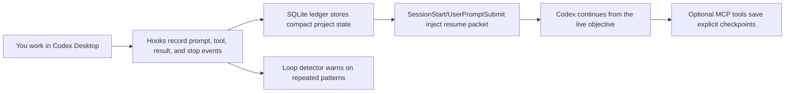

# Compaction Sentinel

[](https://github.com/eduardopto/compaction-sentinel/actions/workflows/test.yml)

Compaction Sentinel is a macOS-only Codex Desktop continuity layer for long-running work. It combines hooks, a local SQLite ledger, a skill, loop detection, and MCP tools so Codex can resume the actual live process after compaction instead of restarting from the last visible message.

It is Codex Desktop-first, dependency-free at runtime, and designed to fail open so normal Codex work continues if Sentinel ever has a problem.

## Why It Exists

Long coding sessions fail in a specific way: the visible task still exists, but after compaction the agent may forget the investigation path, repeat a stale loop, or treat work from two minutes ago as old history. Compaction Sentinel records compact, factual state at the moments that matter and injects a resume packet when Codex starts, resumes, or receives the next user prompt.

## How It Works

You do not need to manually call the skill in every chat. The reliable path is automatic:



The skill is still useful as agent guidance, but the hooks do the heavy lifting after installation.

| Layer | Runs automatically? | Purpose |
| --- | --- | --- |
| User-level hooks | Yes, after restart/trust | Record events and inject resume packets |
| SQLite ledger | Yes | Store checkpoints, notes, and compact event trails by project |
| MCP tools | Available to Codex | Let Codex explicitly save/search checkpoints |
| Skill | Loaded when relevant | Teaches the agent how to behave after compaction |
| Stop continuation | Off by default | Optional unattended continuation for active checkpoints |

## What It Adds

- A `compaction-sentinel` skill for agent behavior after compaction.
- Hooks for `SessionStart`, `UserPromptSubmit`, `PreToolUse`, `PostToolUse`, and `Stop`.
- A local SQLite ledger under `~/.codex/compaction-sentinel/`.
- MCP tools: `compaction_checkpoint`, `compaction_note`, `compaction_packet`, `compaction_search`, and `compaction_status`.
- A CLI: `cs checkpoint`, `cs note`, `cs packet`, `cs status`, `cs search`, `cs doctor`.
- Secret redaction before prompts, tool inputs, or tool outputs are stored.
- Loop warnings when the same prompt/tool/result pattern repeats.
- Optional Stop-hook continuation mode for users who explicitly want Codex to keep going on active checkpoints.
- A Mac-focused `doctor` command that checks runtime files, hooks, MCP config, Python version, and CLI ownership.

## Install

Clone and install:

```bash
git clone https://github.com/eduardopto/compaction-sentinel.git
cd compaction-sentinel
python3 scripts/install.py
```

From an existing checkout:

```bash
python3 scripts/install.py
```

Then restart Codex Desktop and review/trust the new hooks when Codex asks.

On macOS the installer also creates `~/.codex/bin/cs`. If that folder is not on your shell path, run commands with the full path:

```bash
~/.codex/bin/cs doctor
```

For stronger unattended behavior:

```bash
python3 scripts/install.py --auto-continue gentle
```

That mode asks Codex to continue from the latest active checkpoint when a turn stops before completion. It is intentionally opt-in.

Turn it off again with:

```bash
python3 scripts/install.py --auto-continue off
```

## Quick Use

Create a checkpoint before a long or risky stretch:

```bash
~/.codex/bin/cs checkpoint \
  --objective "Fix checkout reliability and verify on device" \
  --current-step "Generation retry path is fixed and tests pass" \
  --next-action "Install on the physical phone and report locked-device launch separately" \
  --evidence "Unit tests passed; native sync completed"
```

Show the packet Codex will receive:

```bash
~/.codex/bin/cs packet
```

Add a durable note:

```bash
~/.codex/bin/cs note "Do not reopen broad roster redesign; visible-face quality is the only remaining blocker."
```

Check install health:

```bash
~/.codex/bin/cs doctor
codex mcp list
```

## Public Plugin Shape

This repository is also packaged as a Codex plugin:

- `.codex-plugin/plugin.json`
- `skills/compaction-sentinel/SKILL.md`
- `hooks/hooks.json`
- `.mcp.json`

Codex plugin hooks are currently opt-in in Codex releases, so the installer writes user-level hooks into `~/.codex/hooks.json` for reliable Desktop behavior. The plugin shape is included for distribution and future plugin-directory workflows.

## Safety

Compaction Sentinel does not replace verification. It preserves state and interrupts obvious repetition, but agents must still read current files, run real checks, and report what was verified.

By default it does not block prompts or force continuation. It records, injects context, and warns. The Stop-hook continuation path only turns on with `--auto-continue gentle` or `--auto-continue strict`.

## Limits

- It does not control OpenAI server-side compaction; it adds a local human-readable continuity layer around Codex Desktop.
- It stores compact local summaries, not full transcripts.
- Codex hooks do not intercept every possible tool path yet, so loop warnings are a guardrail rather than a security boundary.
- Restart Codex Desktop after install so the current UI session reloads hooks and MCP.

## Development

Run the test suite:

```bash
make test
```

Run hook smoke tests by piping sample payloads:

```bash
printf '{"cwd":"%s","session_id":"dev","prompt":"set goal: build the package"}' "$PWD" \
  | PYTHONPATH=src python3 -m compaction_sentinel.cli --codex-home /tmp/cs-home hook UserPromptSubmit
```

See:

- [docs/HOW_IT_WORKS.md](docs/HOW_IT_WORKS.md)
- [docs/MACOS_INSTALL.md](docs/MACOS_INSTALL.md)
- [docs/TROUBLESHOOTING.md](docs/TROUBLESHOOTING.md)
- [docs/VERIFICATION.md](docs/VERIFICATION.md)

## Sources Behind The Design

- Codex hooks support `SessionStart`, `UserPromptSubmit`, `PreToolUse`, `PostToolUse`, and `Stop`, including `additionalContext` injection and Stop-hook continuations.
- Codex skills use progressive disclosure: Codex sees skill metadata first and loads full instructions when relevant.
- Codex plugin hooks are currently off by default unless `plugin_hooks` is enabled, so this project uses user-level hooks for the reliable Mac install.
- OpenAI API compaction carries state forward, but its compacted item is opaque; this project adds a human-readable local ledger for Codex Desktop workflows.
